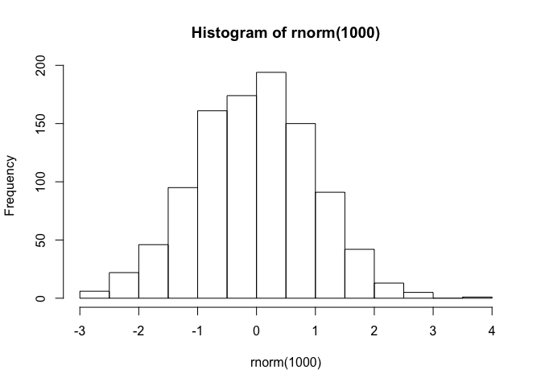

Notebook
================
Me
5/14/2019

# Josh’s

dhsfajkhgdfajkfda

Really fun day coding.

## Day 2 - R Course

The Summer Course started yesterday. We:

  - Ran over introductions
  - Island Tour
  - SHopping

Here is a website I like: <http://jmadinlab.org>

[HIMB](http://jmadinlab.org)

\[ x^2 = \frac{y^2}{z^2} \]

Here is a cool pic of the place.


``` r
# Histogram of ant heights
hist(rnorm(1000))
```

<!-- -->

> Figure 1: Histogram of ant heights
